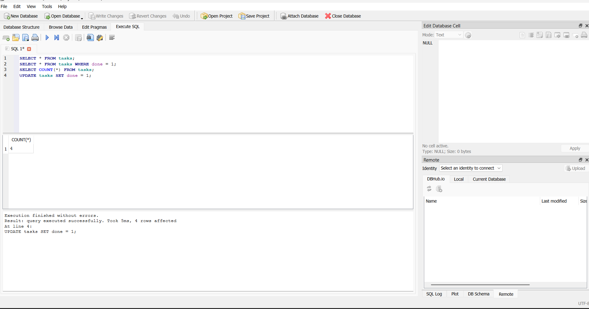

# CRUD API with SQLite

## 📌 Project Overview

This project is a RESTful CRUD API built using **Node.js**, **Express.js**, and **SQLite**. It allows users to create, read, update, and delete tasks. The API documentation is available through Swagger UI.

This project was developed as part of the **FlyRank AI Backend Engineering Internship – Week 3 Assignment**.

---

## 🚀 Features

- Create a new task
- Get all tasks
- Get task by ID
- Update an existing task
- Delete a task
- Swagger API documentation
- SQLite database for persistent storage

---

## 🛠️ Technologies Used

- Node.js
- Express.js
- SQLite
- sqlite3
- Swagger UI
- swagger-jsdoc

---

## 📂 Project Structure

```
CRUD-API/
│── node_modules/
│── tasks.db
│── package.json
│── package-lock.json
│── server.js
│── README.md
```

---

## 💾 Why SQLite?

SQLite was chosen because:

- It is lightweight.
- No separate database server is required.
- Data is stored in a single file (`tasks.db`).
- Data remains available even after restarting the server.
- It is ideal for small backend applications and learning SQL.

---

## 📍 Database Location

The database file is automatically created in the project folder:

```
tasks.db
```

---

## ⚙️ Installation

Clone the repository:

```bash
git clone https://github.com/Kanika-makhloga/CRUD-API.git
```

Move into the project folder:

```bash
cd CRUD-API
```

Install dependencies:

```bash
npm install
```

Run the server:

```bash
node server.js
```

---

## 🌐 API Endpoints

| Method | Endpoint | Description |
|--------|----------|-------------|
| GET | / | API Information |
| GET | /health | Health Check |
| GET | /tasks | Get All Tasks |
| GET | /tasks/:id | Get Task By ID |
| POST | /tasks | Create Task |
| PUT | /tasks/:id | Update Task |
| DELETE | /tasks/:id | Delete Task |

Swagger Documentation:

```
http://localhost:3000/docs
```

---

## 🗄️ Example SQL Query

```sql
SELECT * FROM tasks;
```

Other queries used:

```sql
SELECT * FROM tasks WHERE done = 1;

SELECT COUNT(*) FROM tasks;

UPDATE tasks SET done = 1;

DELETE FROM tasks WHERE done = 1;
```

---

## 📸 Database Screenshot


---

## ▶️ How to Test

1. Start the server

```bash
node server.js
```

2. Open Swagger UI

```
http://localhost:3000/docs
```

3. Test all CRUD endpoints.

---

## 👩‍💻 Author

**Kanika Makhloga**

GitHub:
https://github.com/Kanika-makhloga

LinkedIn:
https://www.linkedin.com/in/kanika-makhloga